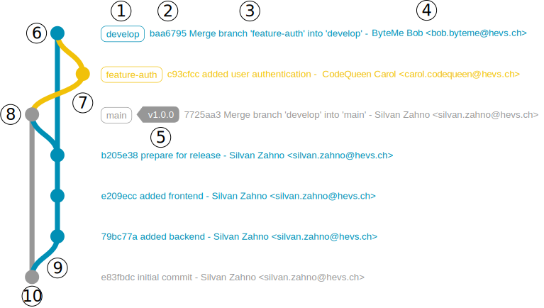

# Answers of Zoé Gobe zogobet

## Basics
### Task 1
- unstaged file commit change : signifie qu'un fichier a été changé mais n'a pas encore été ajouté à l'index pour être commité.
### Task 2
- que signifie le message de commit CHG: personal data changed in answer.md ?
(le nom entré dans mon laboratoire ne correspond pas celui demandé dans les consignes)
Ce message indique qu'un changement a été effectué dans le fichier answer.md, spécifiquement dans la section des données personnelles.

- Peut on créer un commit sans message de commit ?
non , un message de commit est obligatoire pour décrire les modifications apportées.

- Qu'est ce qui change désormais dans le dépot ?
Le dépôt contient désormais un commit avec des modifications apportées au fichier answer.md.

- Le dépot distant (ici github) est-il à jour avec nos modifications ?
non, le dépôt distant n'est pas encore à jour avec les modifications locales tant que les changements n'ont pas été poussés (push) vers le dépôt distant.
### Task 3
Il y a un message untracked files.
### Task 4
- Que se passe-t-il lorsque vous revenez au commit « Initial commit » ? 
le trajet devient violet ce qui signifie que l'on est retourner a un commit précédent.Le commit est alors entièrement restauré.

- Que se passe-t-il lorsque vous revenez au dernier commit ?
lorsque l'on revient au dernier commit, on revient à l'état le plus récent du dépôt et le trajet redevient bleu.
### Task 5
- Quelle est la différence entre le dépôt local et le dépôt distant ?
Le dépôt local est la copie du projet sur votre machine, tandis que le dépôt distant est une version hébergée sur un serveur (comme GitHub) accessible par plusieurs 
utilisateurs.

- Que se passerait-il si vous supprimiez le dépôt local ?
Si vous supprimez le dépôt local, vous perdrez toutes les modifications non poussées vers le dépôt distant. Cependant, le dépôt distant restera intact.
### Task 6
- Avec toutes ces manipulations, qu’en est-il du dépôt originel, celui ayant été
forké ?
Le dépôt originel reste inchangé. Les modifications apportées dans le fork n'affectent pas le dépôt original tant que vous ne créez pas une pull request et que celle-ci n'est pas fusionnée.

- A-t’il été modifié ?
Non, le dépôt originel n'a pas été modifié par les actions effectuées dans le fork.
## Gitgraph

### Task 7
 - Nommez tous les éléments visibles dans l’image Figure 24 (points 1 à 10)
1. nom de la branche
2. hash de commit
3. message de commit
4. auteur du commit
5. tag
6. dernier commit
7. branche secondaire (feature-auth)
8. last commit de la branche initiale
9. branche secondaire (develop)
10. branche main
